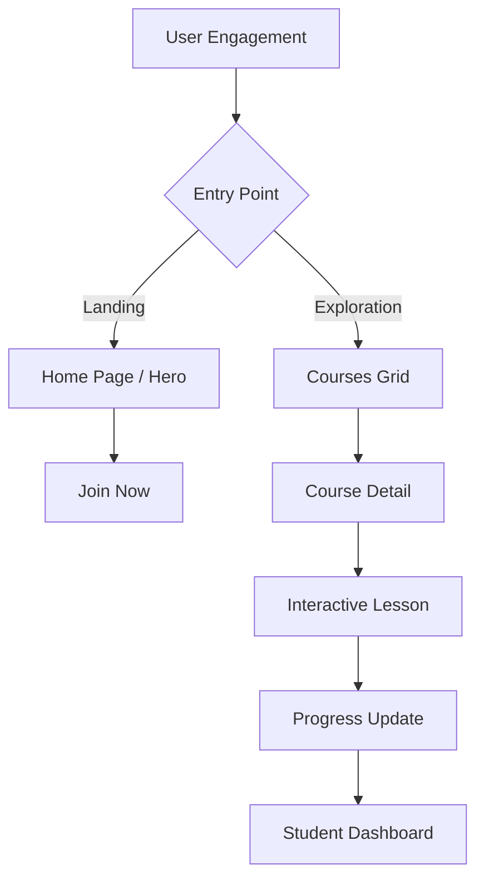
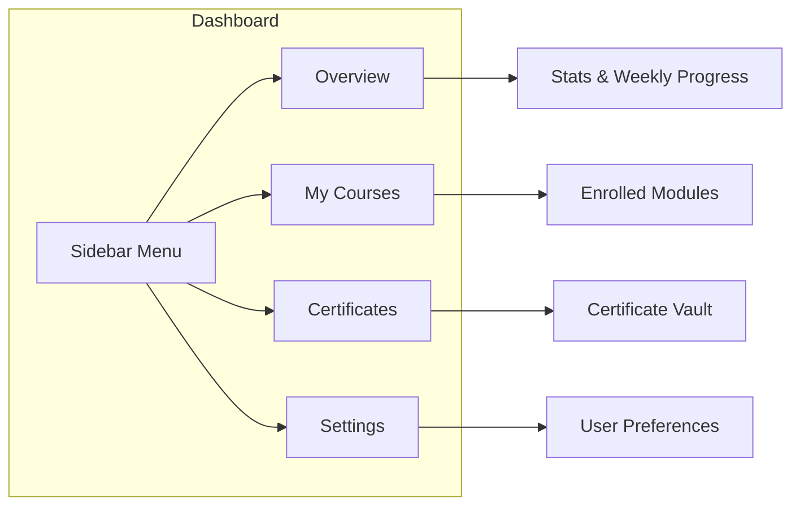
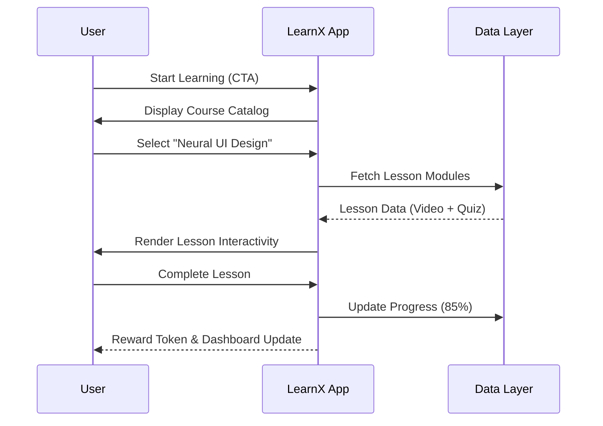
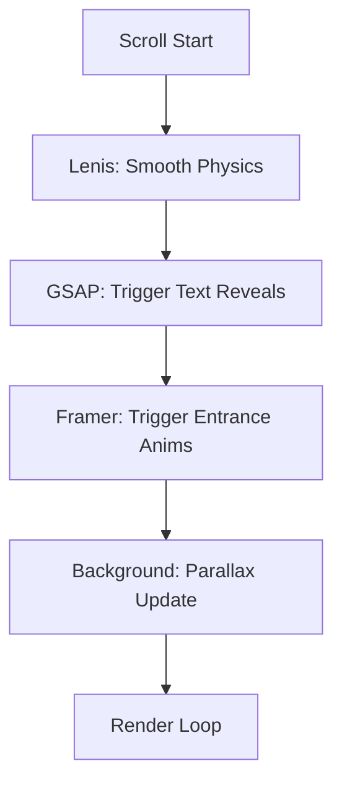
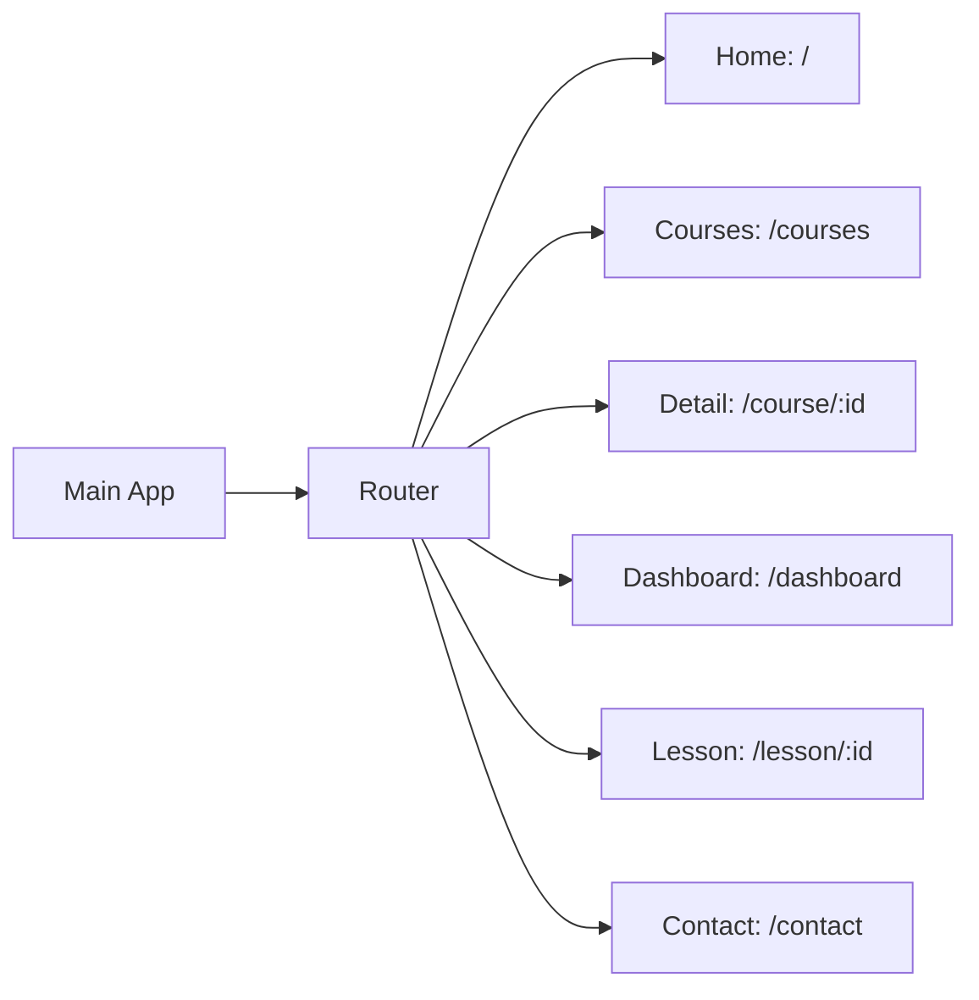
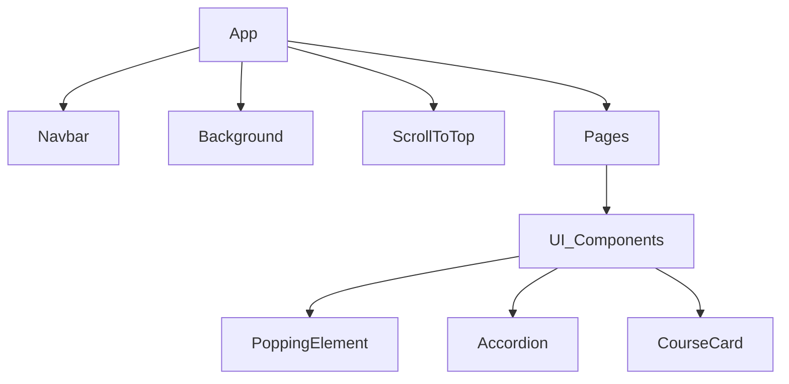
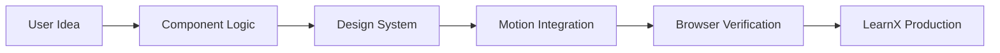

# LearnX: The Futuristic Learning Ecosystem

Welcome to **LearnX**, a premium 2027-inspired EdTech platform designed for the next generation of digital learners. This platform combines high-end aesthetics, smooth motion design, and a robust interactive dashboard to provide an unparalleled learning experience.

---

## Technical Platform Core Features

| Feature | Description | Technology |
| :--- | :--- | :--- |
| **Futuristic UI** | Glassmorphic design with HSL dynamic color tokens. | Tailwind CSS v4 |
| **Smooth Navigation** | Momentum-based scrolling and parallax transitions. | Lenis + GSAP |
| **Interactive Dashboard** | Real-time progress tracking and module switching. | Framer Motion |
| **Neural Learning Vault** | A centralized hub for all your certificates and courses. | React 19 |
| **Responsive Design** | Optimized for mobile, tablet, and desktop viewing. | Grid & Flexbox |

---

## Tech Stack Matrix

| Layer | Technology | Purpose |
| :--- | :--- | :--- |
| **Framework** | React 19 + Vite 8 | Core Engine & Build Speed |
| **Styling** | Tailwind CSS v4 | Futuristic Design System |
| **Motion** | GSAP 3.12 | Text Reveals & Parallax |
| **Interaction** | Framer Motion | Component States & UI Logic |
| **Scrolling** | Lenis | Smooth Momentum Physics |
| **Icons** | Lucide-React | Scalable Vector UI Assets |

---

## System Architecture

### 1. High-Level App Flow


### 2. Dashboard Navigation Logic


---

## Design System Tokens

| Token | HSL Value | Usage |
| :--- | :--- | :--- |
| **Background** | 240 10% 2% | Deep Space Canvas |
| **Primary** | 221.2 83.2% 53.3% | Core Brand & Action Glow |
| **Muted** | 240 3.7% 10% | Card Backgrounds |
| **Glass** | bg-white/5 blur-xl | Translucent Overlays |

---

## User Journey Mapping

### 3. Learning Pathway Flow


### 4. Animation Strategy Flow


---

## Animation Integration

| Component | Library | Specific Animation Effect |
| :--- | :--- | :--- |
| **Navbar** | CSS/Tailwind | Glass-Blur sticky transition |
| **Hero Text** | GSAP | Sequential character-level reveal |
| **Course Cards** | Framer Motion | Hover-scale with glowing borders |
| **Dashboard** | Framer Motion | Tab-content AnimatePresence |
| **Background** | Custom SVG | Pulsing circuit lines & scanlines |

---

## Project Structure & Routing

### 5. Application Routing Graph


### 6. Component Dependency Tree


### 7. Core Development Loop


---

## Installation

1. **Clone the repository**:
   ```bash
   git clone <repo-url>
   ```
2. **Install dependencies**:
   ```bash
   npm install
   ```
3. **Start the Neural Engine**:
   ```bash
   npm run dev
   ```

---

## Project Management Matrix

| Task | Status | Importance |
| :--- | :--- | :--- |
| **Design System** | Completed | Critical |
| **Home Page** | Completed | High |
| **Interactive Dashboard** | Completed | High |
| **Live Background** | Completed | Medium |
| **Certificates Vault** | Scheduled | Low |

---

© 2027 LearnX - Interactive Tech Learning Platform. Built for excellence.
